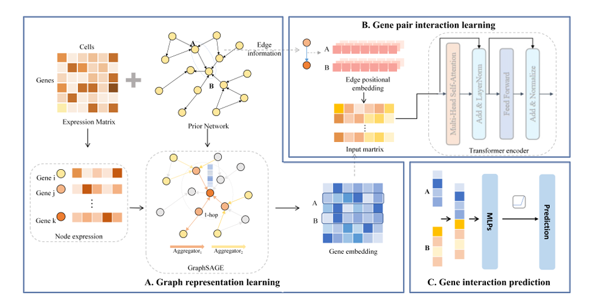

#  Inferring gene regulatory networks from single-cell transcriptomics jointly through graph neural networks and transformer

## Abstract

Inferring gene regulatory networks (GRNs) is es sential for understanding intricate regulatory interactions that govern gene expression in cells. Recently, several computational methods have been developed to reconstruct GRNs from single cell RNA sequencing (scRNA-seq) data. However, most of these methods primarily focus on pairwise regulatory relationships between genes, without fully leveraging the global regulatory structure of GRNs, which is crucial for exploring the complex regulatory interactions between transcription factors (TFs) and their target genes. To address these limitations, we propose a novel supervised learning framework, GTGRNS, to infer gene regulatory networks from scRNA-seq data by integrating graph neural networks and the transformer model. GTGRNS captures global topological semantic information through a GNN and learns deep intrinsic interactions between genes using the transformer model. Specifically, we utilize the GraphSAGE model to integrate regulatory network topological information with gene expression features, thereby facilitating the learning of gene representations. By leveraging the transformer model, we further extract complex dependencies of gene pairs, which are crucial for determining regulatory levels. The comparative experiments on seven benchmark datasets demonstrate the effectiveness and competitiveness of the proposed GTGRNS in the task of GRN inference. Our method GTGRNS is implemented in Python using the Pytorch machine learning library, and it is freely available at https://github.com/DHUDBlab/GTGRNS

## Install Application:

1.Anaconda (https://www.anaconda.com/) 2.Git(https://github.com/)

## Enviorment:

numpy == 1.19.5

pandas== 0.25.3

scikit-learn == 1.0.2 

torch == 1.9.0

## Running

python main.py